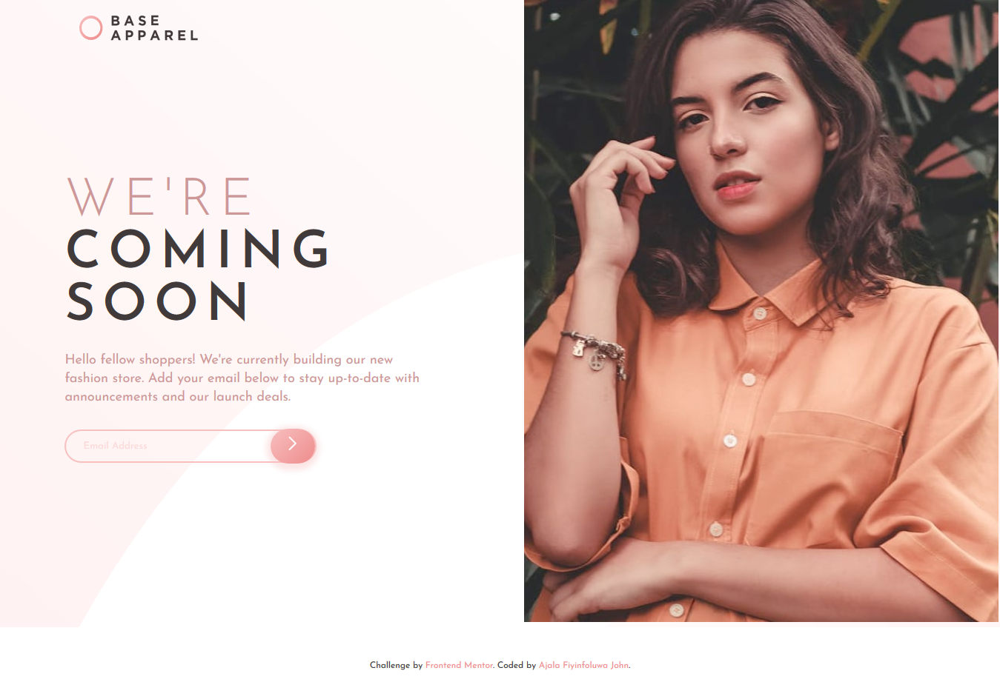
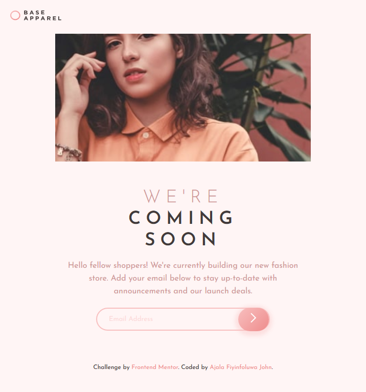

# Frontend Mentor - [Base Apparel coming soon page solution](https://kodaas.github.io/coming-soon_html_css/)

This is a solution to the [Base Apparel coming soon page challenge on Frontend Mentor](https://www.frontendmentor.io/challenges/base-apparel-coming-soon-page-5d46b47f8db8a7063f9331a0). Frontend Mentor challenges help you improve your coding skills by building realistic projects.

## Table of contents

- [Overview](#overview)
  - [The challenge](#the-challenge)
  - [Screenshot](#screenshot)
    - [Desktop](#desktop_1)
    - [Mobile](#mobile)
    - [Tablet](#tablet)
  - [Links](#links)
- [My process](#my-process)
  - [Built with](#built-with)
  - [What I learned](#what-i-learned)
  - [Continued development](#continued-development)
- [Author](#author)

## Overview

### The challenge

Users should be able to:

- View the optimal layout for the site depending on their device's screen size
- See hover states for all interactive elements on the page
- Receive an error message when the `form` is submitted if:
  - The `input` field is empty
  - The email address is not formatted correctly

### Screenshot

#### Desktop 1



#### Desktop 2


#### Mobile


#### Tablet



<!-- Alternatively, you can use a tool like [FireShot](https://getfireshot.com/) to take the screenshot. FireShot has a free option, so you don't need to purchase it. -->

### Links

- Solution URL: [GitHub code](https://github.com/kodaas/coming-soon_html_css)
- Live Site URL: [Live Site](https://kodaas.github.io/coming-soon_html_css/)

## My process

`HTML -> CSS -> JavaScript`

### Built with

- Semantic HTML5 markup
- CSS custom properties
- Flexbox
- CSS Grid
- Mobile-first workflow

### What I learned

```css
.proud-of-this-css {
  display: grid;
  place-items: center;
}
```

If you want more help with writing markdown, we'd recommend checking out [The Markdown Guide](https://www.markdownguide.org/) to learn more.

### Continued development

I would like to improve more on my javascript, and then move to backend using nodejs.

## Author

- Website - [Ajala Fiyinfoluwa John](https://github.com/kodaas)
- Frontend Mentor - [@yourusername](https://www.frontendmentor.io/profile/Ajala-John)
<!-- - Twitter - [@yourusername](https://www.twitter.com/yourusername) -->
